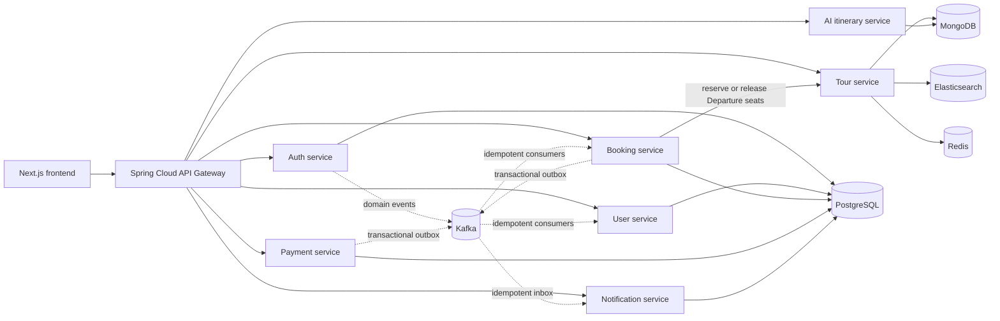

# JourneyAI — Việt Khám Phá Backend

A production-minded microservices backend for Vietnam tour booking, payment, notification, and AI-assisted itinerary planning.

Việt Khám Phá tập trung vào Tour ghép trọn gói, Tour riêng có giá xác định trước và hành trình tự túc bằng AI. Khách sạn, xe, bữa ăn, vé tham quan và bảo hiểm là thành phần của package Tour; hệ thống không xây inventory kiểu OTA.

[](https://github.com/trinhxuanhuan/journeyai/actions/workflows/ci.yml)

**Repositories:** Backend (repository này) · [Frontend](https://github.com/trinhxuanhuan/journeyai-frontend)

**Status:** MVP release candidate với CI tự động, Docker release images và smoke workflow xuyên service.

## Engineering highlights

- **Concurrency-safe group booking:** capacity thuộc từng Departure, giữ chỗ 15 phút và tự động hoàn chỗ khi booking hết hạn hoặc bị hủy.
- **Stable commercial history:** giá, package và chính sách hoàn/hủy được snapshot tại thời điểm đặt để thay đổi Tour sau này không làm sai booking cũ.
- **Reliable distributed workflows:** idempotency key cho các thao tác nhạy cảm, transactional outbox cho domain events và inbox/deduplication ở consumer Kafka.
- **Payment integrity:** kiểm tra callback VNPay, bảo vệ trước callback lặp/đồng thời, xử lý thanh toán đến muộn và refund idempotency.
- **Secure account lifecycle:** xác thực OTP, JWT access/refresh token, refresh-token rotation và thu hồi phiên đăng nhập.
- **Independent AI planning:** miền itinerary tách khỏi Tour/Booking, hỗ trợ tạo, lưu, tinh chỉnh, dự toán và chia sẻ công khai an toàn.

## Kiến trúc hệ thống



Frontend và backend là hai repository độc lập, giao tiếp qua contract `/v1/**` tại API Gateway. Giao tiếp đồng bộ giữa các service chỉ được dùng khi cần phản hồi tức thời; các sự kiện nghiệp vụ bền vững đi qua Kafka.

## Miền nghiệp vụ MVP

- Tour ghép: `Tour -> Departure -> Booking -> Participants -> Payment`; capacity và HDV cụ thể thuộc từng Departure.
- Tour riêng: một Booking là một đoàn riêng, giá `PER_PERSON` hoặc `PER_GROUP`, không dùng shared capacity; HDV có thể included/optional/none.
- AI itinerary: planner grounded tạo/lưu/chỉnh sửa/chia sẻ lịch trình, kiểm tra lịch và dự toán; không phụ thuộc Tour/Booking.
- Notification: service độc lập nhận sự kiện Auth/Booking/Payment qua Kafka, cung cấp hộp thư trong ứng dụng, tùy chọn email và nhắc khởi hành.
- Các thành phần khách sạn, phòng, xe, bữa ăn, vé và bảo hiểm được lưu trong package Tour.

API contract chi tiết: [docs/MVP_API_CONTRACT.md](docs/MVP_API_CONTRACT.md).

## Công nghệ và service

- Java 17, Spring Boot, Spring Cloud Gateway
- FastAPI cho AI service
- PostgreSQL cho Auth/User/Booking/Payment/Notification
- MongoDB cho Tour và AI itinerary
- Redis, Elasticsearch, Kafka/outbox, Zipkin

Các module hiện có: `api-gateway`, `auth-service`, `user-service`, `tour-service`, `booking-service`, `payment-service`, `notification-service`, `ai-service`.

## Chạy local

```powershell
Copy-Item .env.example .env
# Cấu hình JWT_SIGNING_SECRET đủ dài và thông tin VNPay sandbox nếu cần.

docker compose up -d --build
docker compose ps
```

API Gateway: `http://localhost:8090`. AI health public:

```powershell
Invoke-RestMethod http://localhost:8090/v1/ai/ping
```

Nếu dùng database được tạo trước khi dự án chuyển sang Flyway, làm đúng [runbook migration legacy](docs/LEGACY_DB_MIGRATION.md); không bật baseline tự động khi chưa chạy preflight.

## Kiểm tra

Java reactor:

```powershell
mvn clean verify
```

AI service:

```powershell
python -m pytest ai-service/tests
# Hoặc khi máy chưa có Python/pytest nhưng Docker stack đang chạy:
docker compose exec -T ai-service python -m pytest tests
```

Smoke test xuyên service sau khi Docker stack đã chạy:

```powershell
./scripts/smoke-auth-account.ps1
./scripts/smoke-be-mvp.ps1
```

`smoke-auth-account.ps1` kiểm tra đăng ký, OTP, Kafka profile, cập nhật tài khoản, refresh-token rotation và thu hồi phiên sau logout bằng token thật. Script chỉ tự đọc OTP từ log container local khi `EMAIL_ENABLED=false`; tài khoản tổng hợp `@example.invalid` được giữ lại để không cần tạo endpoint xóa người dùng nguy hiểm.

`smoke-be-mvp.ps1` tạo dữ liệu có prefix `[SMOKE ...]`, kiểm tra GROUP/PRIVATE, Departure capacity, pricing snapshot, idempotency, Notification qua Kafka, Payment `INITIATED` và AI itinerary sharing. Mặc định script xóa Tour, reindex Elasticsearch và vô hiệu hóa HDV vừa tạo; các Booking/Payment/Notification/AI snapshot tổng hợp vẫn được giữ để kiểm tra tính bất biến và audit. Không script nào thực hiện giao dịch hoặc refund thật.

## Tài liệu kỹ thuật

| Tài liệu | Nội dung |
| --- | --- |
| [MVP API contract](docs/MVP_API_CONTRACT.md) | Contract và quy tắc nghiệp vụ xuyên service |
| [AI Planner V1](docs/AI_PLANNER_V1.md) | Thiết kế grounded planner và quality gates |
| [Delivery roadmap](docs/DELIVERY_ROADMAP.md) | Phạm vi và thứ tự hoàn thiện sản phẩm |
| [Legacy DB migration](docs/LEGACY_DB_MIGRATION.md) | Preflight và chuyển database cũ sang Flyway |
| [Release candidate runbook](docs/RELEASE_CANDIDATE_RUNBOOK.md) | Quy trình kiểm định đầy đủ trước phát hành |
| [Staging deployment](docs/STAGING_DEPLOYMENT.md) | Dựng môi trường công khai an toàn |
| [Portfolio release](docs/PORTFOLIO_RELEASE.md) | Checklist E2E và bằng chứng sản phẩm |
| [Final release](docs/FINAL_RELEASE.md) | Docker image bất biến và ghi chú phát hành |

## Catalog tour đã kiểm chứng

`catalog/verified-tour-catalog.v1.json` chứa nội dung tour công khai và nguồn đối chiếu địa danh. Import tour và reindex Elasticsearch bằng tài khoản quản trị:

```powershell
./scripts/import-verified-tour-catalog.ps1 `
  -BaseUrl http://localhost:8090 `
  -AdminAccessToken $env:VKP_ADMIN_ACCESS_TOKEN
```

Tour ghép chỉ nhận booking khi có Departure `OPEN`, còn chỗ và đã được phân công hướng dẫn viên. Việc công bố lịch là thao tác vận hành riêng, yêu cầu `-GuideMap` hoặc tệp JSON `-GuideMapPath` ánh xạ `guideKey` sang `guideId` đang hoạt động. Mỗi lịch đồng thời dùng một `guideKey` riêng để không vô tình phân công một HDV cho hai đoàn:

```powershell
./scripts/import-verified-tour-catalog.ps1 `
  -BaseUrl http://localhost:8090 `
  -AdminAccessToken $env:VKP_ADMIN_ACCESS_TOKEN `
  -PublishDepartures `
  -GuideMapPath ./guide-map.local.json
```

Importer giữ nhịp lịch đã cấu hình, bỏ qua Departure trùng ngày và tự dịch lô lịch mới tới tối thiểu 7 ngày sau thời điểm chạy. Không commit access token hoặc `guide-map.local.json` chứa dữ liệu vận hành.

## Migration hiện tại

- Booking: `V1` baseline, `V2` status, `V3` idempotency, `V4` payment inbox, `V5` Departure, `V6` GROUP/PRIVATE + commercial snapshot.
- Payment: `V1` baseline, `V2` payment idempotency, `V3` refund inbox/idempotency.
- Notification: `V1` recipient snapshot, Kafka inbox, read state, email delivery và nhắc khởi hành.
- User: `V1` baseline hồ sơ, `V2` validation/unique constraint cho điện thoại, avatar và sở thích.
- Tour: backfill MongoDB additive, idempotent khi startup.

Mọi migration đều giữ dữ liệu cũ và dừng sớm khi precondition không an toàn.
