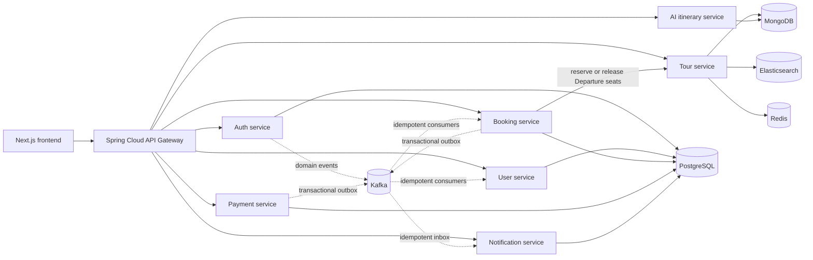

# JourneyAI — Việt Khám Phá Backend

A production-minded microservices backend for Vietnam tour booking, payment, notification, and AI-assisted itinerary planning.

Việt Khám Phá focuses on scheduled group tours, fixed-price private tours, and independent AI-assisted itineraries. Hotels, transportation, meals, attraction tickets, and insurance are modeled as tour-package components rather than standalone OTA inventory.

[](https://github.com/trinhxuanhuan/journeyai/actions/workflows/ci.yml)

**Repositories:** Backend (this repository) · [Frontend](https://github.com/trinhxuanhuan/journeyai-frontend)

**Status:** MVP release candidate with automated CI, Docker release images, and cross-service smoke workflows.

## Engineering highlights

- **Concurrency-safe group booking:** capacity belongs to each `Departure`, with a 15-minute hold and automatic seat release when a booking expires or is cancelled.
- **Stable commercial history:** prices, package details, and cancellation policies are snapshotted at booking time so later tour changes cannot alter historical bookings.
- **Reliable distributed workflows:** idempotency keys protect sensitive operations, transactional outboxes publish domain events, and Kafka consumers use inbox/deduplication safeguards.
- **Payment integrity:** VNPay callbacks are verified and protected against duplicate or concurrent delivery, with late-payment reconciliation and idempotent refunds.
- **Secure account lifecycle:** OTP verification, JWT access/refresh tokens, refresh-token rotation, and session revocation.
- **Independent AI planning:** itinerary generation is separated from the tour-booking domain and supports creation, persistence, refinement, budgeting, and safe public sharing.

## System architecture



The frontend and backend are maintained in separate repositories and communicate through the `/v1/**` contract at the API Gateway. Synchronous service calls are reserved for immediate responses, while durable business events are delivered through Kafka.

## MVP business domains

- **Group tours:** `Tour -> Departure -> Booking -> Participants -> Payment`. Multiple bookings share one departure; capacity and the assigned guide belong to that departure.
- **Private tours:** one booking represents one private group, priced `PER_PERSON` or `PER_GROUP` without shared capacity; guide mode can be `INCLUDED`, `OPTIONAL`, or `NONE`.
- **AI itineraries:** a grounded planner creates, stores, refines, validates, budgets, and shares itineraries independently from `Tour` and `Booking`.
- **Notifications:** an independent service consumes Auth, Booking, and Payment events through Kafka, provides an in-app inbox, supports email preferences, and schedules departure reminders.
- **Tour packages:** accommodation, room details, transportation, meals, tickets, and insurance are embedded package information.

Detailed API contract: [docs/MVP_API_CONTRACT.md](docs/MVP_API_CONTRACT.md).

## Technology and services

- Java 17, Spring Boot, and Spring Cloud Gateway
- FastAPI for the AI service
- PostgreSQL for Auth, User, Booking, Payment, and Notification
- MongoDB for Tour and AI itinerary data
- Redis, Elasticsearch, Kafka/outbox, Zipkin

Modules: `api-gateway`, `auth-service`, `user-service`, `tour-service`, `booking-service`, `payment-service`, `notification-service`, and `ai-service`.

## Run locally

```powershell
Copy-Item .env.example .env
# Set a sufficiently long JWT_SIGNING_SECRET and VNPay sandbox credentials when needed.

docker compose up -d --build
docker compose ps
```

API Gateway: `http://localhost:8090`. Public AI health endpoint:

```powershell
Invoke-RestMethod http://localhost:8090/v1/ai/ping
```

For databases created before the project adopted Flyway, follow the [legacy database migration runbook](docs/LEGACY_DB_MIGRATION.md). Do not enable automatic baselining before completing the preflight checks.

## Verification

Java reactor:

```powershell
mvn clean verify
```

AI service:

```powershell
python -m pytest ai-service/tests
# Alternatively, run the tests inside an active Docker stack:
docker compose exec -T ai-service python -m pytest tests
```

Cross-service smoke tests after the Docker stack is running:

```powershell
./scripts/smoke-auth-account.ps1
./scripts/smoke-be-mvp.ps1
```

`smoke-auth-account.ps1` verifies registration, OTP, Kafka-driven profile creation, account updates, refresh-token rotation, and session revocation after logout using real tokens. It reads OTP values from local container logs only when `EMAIL_ENABLED=false`; synthetic `@example.invalid` accounts are retained to avoid exposing an unsafe user-deletion endpoint.

`smoke-be-mvp.ps1` creates `[SMOKE ...]` data and verifies group/private tours, departure capacity, pricing snapshots, idempotency, Kafka notifications, `INITIATED` payments, and AI-itinerary sharing. By default, it removes the generated tour, reindexes Elasticsearch, and deactivates the generated guide; synthetic Booking, Payment, Notification, and AI snapshots remain available for immutability and audit checks. Neither script performs a real payment or refund.

## Technical documentation

| Document | Purpose |
| --- | --- |
| [MVP API contract](docs/MVP_API_CONTRACT.md) | Cross-service contracts and business rules |
| [AI Planner V1](docs/AI_PLANNER_V1.md) | Grounded planner design and quality gates |
| [Delivery roadmap](docs/DELIVERY_ROADMAP.md) | Product scope and delivery sequence |
| [Legacy DB migration](docs/LEGACY_DB_MIGRATION.md) | Preflight and migration from legacy schemas to Flyway |
| [Release candidate runbook](docs/RELEASE_CANDIDATE_RUNBOOK.md) | Full pre-release verification procedure |
| [Staging deployment](docs/STAGING_DEPLOYMENT.md) | Safe public-environment deployment |
| [Portfolio release](docs/PORTFOLIO_RELEASE.md) | End-to-end checklist and product evidence |
| [Final release](docs/FINAL_RELEASE.md) | Immutable Docker images and release notes |

## Verified tour catalog

`catalog/verified-tour-catalog.v1.json` contains public tour content and sources used to verify destinations. Import tours and reindex Elasticsearch with an administrator account:

```powershell
./scripts/import-verified-tour-catalog.ps1 `
  -BaseUrl http://localhost:8090 `
  -AdminAccessToken $env:VKP_ADMIN_ACCESS_TOKEN
```

Group tours accept bookings only when an `OPEN` departure has available seats and an assigned guide. Publishing departures is a separate operational step and requires either `-GuideMap` or a `-GuideMapPath` JSON file that maps each `guideKey` to an active `guideId`. Concurrent departures use distinct guide keys to prevent accidental double assignment:

```powershell
./scripts/import-verified-tour-catalog.ps1 `
  -BaseUrl http://localhost:8090 `
  -AdminAccessToken $env:VKP_ADMIN_ACCESS_TOKEN `
  -PublishDepartures `
  -GuideMapPath ./guide-map.local.json
```

The importer preserves the configured schedule cadence, skips duplicate departure dates, and shifts new batches to start at least seven days after execution. Never commit access tokens or a `guide-map.local.json` file containing operational data.

## Current migrations

- Booking: `V1` baseline, `V2` status, `V3` idempotency, `V4` payment inbox, `V5` Departure, `V6` group/private tours and commercial snapshots.
- Payment: `V1` baseline, `V2` payment idempotency, `V3` refund inbox/idempotency.
- Notification: `V1` recipient snapshot, Kafka inbox, read state, email delivery, and departure reminders.
- User: `V1` profile baseline, `V2` phone validation/uniqueness, avatar, and travel preferences.
- Tour: additive and idempotent MongoDB backfill at startup.

All migrations preserve legacy data and fail fast when their safety preconditions are not met.
